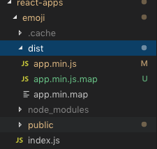

# Jugar con React en Wordpress,
# the painless way.

# 
##### Child theme usado [github.com/burzumumbra/meet-wordpress](http://github.com/burzumumbra/meet-wordpress)

---

# Abordaremos (rapidamente)

- **React es...**
- Como usa WordPress a React
- Razon por la que WordPress esta utilizando React
- Ejemplos
- Como hacerlo de manera sencilla
##### Child theme usado [github.com/burzumumbra/meet-wordpress](http://github.com/burzumumbra/meet-wordpress)

---

## React es...

>React es una librería Javascript focalizada en el desarrollo de interfaces de usuario. Así se define la propia librería y evidentemente, esa es su principal área de trabajo.

---

## Como usa WordPress a React

# **Gutenberg amigos**

# 

---

## Razon por la que WordPress esta utilizando React

# 

---

# Ejemplos
## Agregar Emojis Reactions a tu blog.
# 

---

# Ejemplos
## Agregar una galeria de fotos.
# 

---

# Requisitos
## Node JS [nodejs.org](https://nodejs.org/en/)
## Parcel JS [es.parceljs.org](https://es.parceljs.org/getting_started.html)

---

## Node JS
# [nodejs.org](https://nodejs.org/en/)
# 

---

## Parcel JS
# [es.parceljs.org](https://es.parceljs.org/getting_started.html)
# 

---

## Parcel JS: Instalacion
# [es.parceljs.org](https://es.parceljs.org/getting_started.html)
# 

---

# Configuracion: Estructura del child theme
# 

---

# Configuracion: Page Templates
# 

---

# Configuracion: Enqueue Page Template
# 

---

# Configuracion: Enqueue function.php
# 

---

# Configuracion: package.json `npm init -y`
# 

---

# Configuracion: package.json script
# 

---

# Configuracion: package.json agregar dependencias e instalar
# 

---

# Correr nuestra app
# 

---

# Correr nuestra app: Archivos generados
# 

---

# Correr nuestra app: Produccion
# 

---
# Correr nuestra app: Archivos generados
# 

---
---
# Enqueue: Archivos generados 
# 

---

## Espero disfrutaran :+1:

### https://github.com/burzumumbra/meet-wordpress
